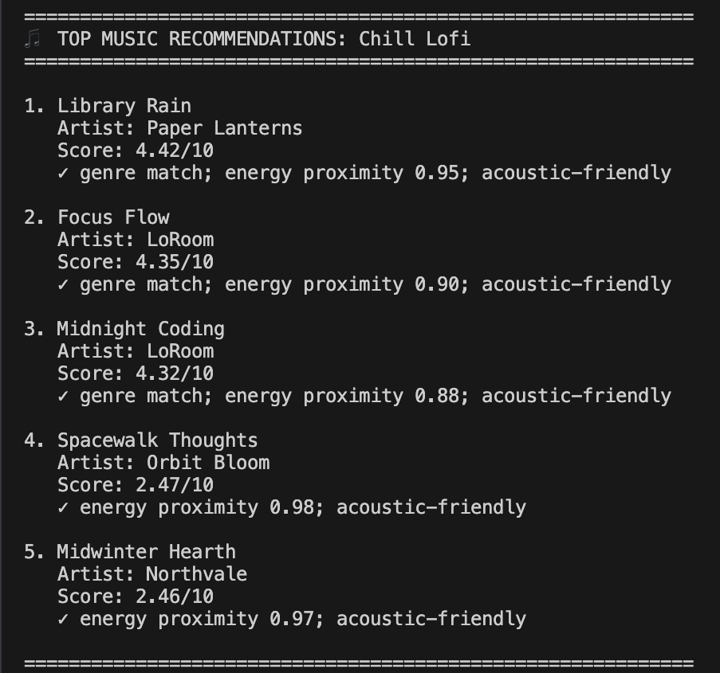
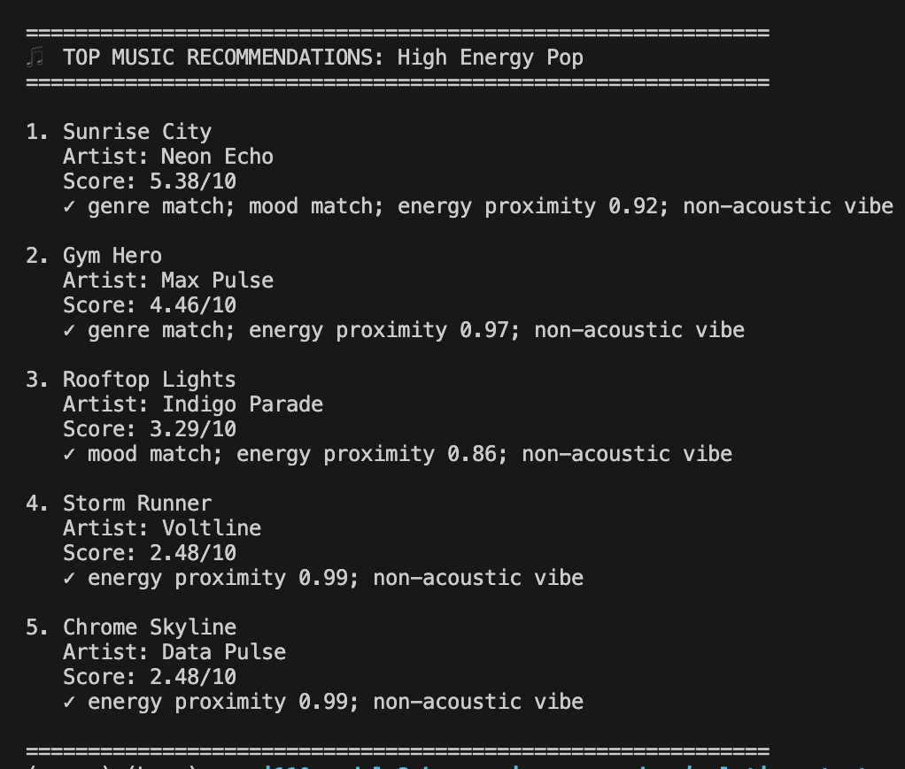
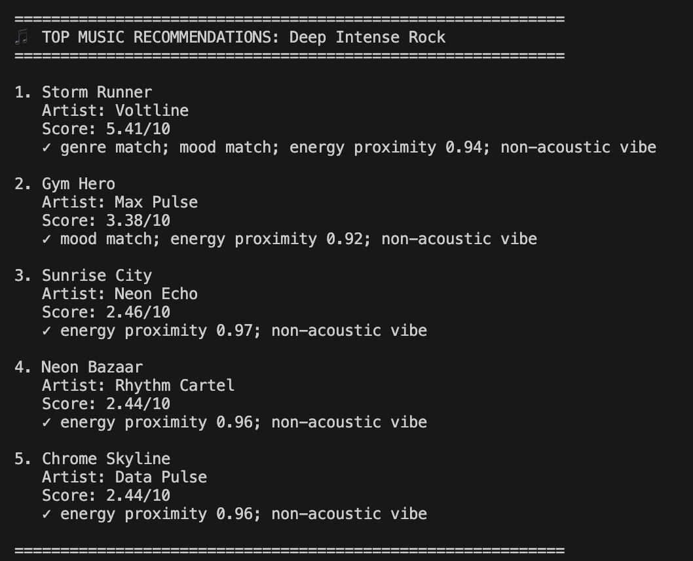

# 🎵 Music Recommender Simulation

## Project Summary

This project builds a small, transparent, content-based music recommender.
It takes a user profile and ranks songs from a CSV catalog.
The score uses genre, mood, energy proximity, and acoustic preference.
I tested multiple profiles to see how small weight changes affect recommendations.

---

## How The System Works

This version uses a simple scoring system.
Each song is compared to the user profile.
Then songs are sorted by score and the top 5 are returned.

### Features Used

**Song features (`Song`)**

- `genre`
- `mood`
- `energy`
- `tempo_bpm`
- `valence`
- `danceability`
- `acousticness`

**User profile features (`UserProfile` / preferences)**

- `favorite_genre`
- `favorite_mood`
- `target_energy`
- `likes_acoustic`

### Finalized Algorithm Recipe

1. Load songs from `data/songs.csv`.
2. For each song:
   - Add `+1.0` for genre match.
   - Add `+1.0` for mood match.
   - Compute energy proximity as `1 - |song_energy - target_energy|`.
   - Add `+3.0 * proximity` (current experiment setting).
   - Add `+1.0` for acoustic fit (`likes_acoustic` vs `acousticness`).
3. Sort songs by score (highest first).
4. Return top `k` songs with explanations.

Current weights used:

- `genre: 1.0`
- `mood: 1.0`
- `energy: 3.0`
- `acoustic preference bonus: 1.0`

### Potential Biases / Risks

- This system can over-prioritize energy similarity.
- Mood and genre labels are subjective and sometimes coarse.
- The dataset is small, so diversity is limited.
- Recommendation quality depends on manual weights.

---

## Getting Started

### Setup

1. Create a virtual environment (optional but recommended):

   ```bash
   python -m venv .venv
   source .venv/bin/activate      # Mac or Linux
   .venv\Scripts\activate         # Windows

   ```

2. Install dependencies

```bash
pip install -r requirements.txt
```

3. Run the app:

```bash
python -m src.main
```

### Running Tests

Run the starter tests with:

```bash
pytest
```

You can add more tests in `tests/test_recommender.py`.

---

## Experiments You Tried

I tested three profiles:

- High-Energy Pop
- Chill Lofi
- Deep Intense Rock

I also ran a weight-shift experiment:

- Genre weight reduced from `2.0` to `1.0`
- Energy weight increased from `1.5` to `3.0`

Result: rankings became more sensitive to energy proximity. Some non-target genres moved up if their energy was very close to the profile target.

---

## Limitations and Risks

- Tiny catalog (20 songs) limits realism.
- No user history, skips, or session context.
- No lyric, language, or artist-relationship modeling.
- Can create an energy filter bubble.
- Not suitable for real production decisions.

---

## Reflection

Read the full model card:

[**Model Card**](model_card.md)

My biggest learning moment was seeing how one weight change can reshape the whole ranking. When I doubled energy and reduced genre, the list quickly favored energy-near songs, even from unexpected genres. That showed me how recommender behavior is very sensitive to small design choices.

AI tools helped me move faster when drafting profiles, updating logic, and generating comparison notes. I still had to double-check outputs against actual runs, because suggested text and assumptions were sometimes cleaner than what the code really did. I was surprised that a simple point-based scorer could still feel like a real recommendation system once preferences were clear. If I extend this project, I would add diversity controls, preference ranges instead of single targets, and a small feedback loop to tune weights from user reactions.

---





